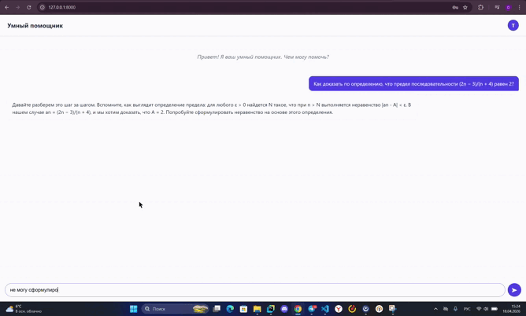

# Педагогический Ассистент на базе дообученной LLM

Проект представляет собой интеллектуального помощника для анализа педагогических практик, основанный на дообученной языковой модели Qwen2.5-7B-Instruct. Система анализирует расшифровки занятий и предоставляет оценку по ключевым педагогическим метрикам: диалогичность, корректировка ошибок, развитие логики и поддерживающий стиль общения.

## Содержание
1. diplom_data - Данные для обучения модели
2. model-finetuning - Обучение модели
3. model-restoration - Восстановление модели
4. fastapi-service - Сервис FastAPI для работы с моделью
5. django-web - Django приложение для удобного пользования моделью

## Демонстрация работы
